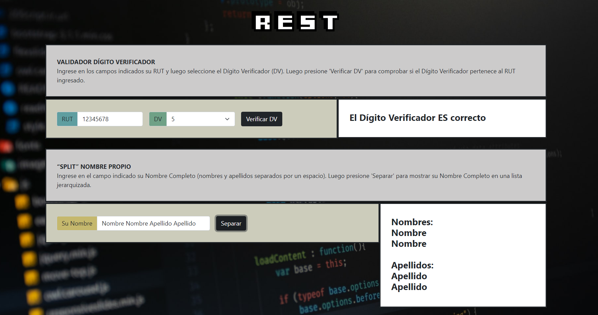

# RCD Trabajo 1: WEB SERVICES SOAP/REST

## Enunciado del trabajo

Construir Web Services (SOAP y REST) que puedan realizar los métodos de Verificación de RUT y 
Separador Jerárquico de Nombres. Se deberá construir un Cliente y un Servicio para cada Web Services pedido.
El lenguaje de programación de los Servicios debe ser distinto al usado para los Clientes, y a su vez, los lenguajes 
de programación para los Servicios deben ser distintos.

## Métodos de integración

*VALIDADOR DÍGITO VERIFICADOR*: El método debe recibir la parte entera de un RUT y un Dígito Verificador 
(ejemplo 12345678; K) como campos separados y devolver como respuesta un indicador de si el Dígito 
Verificador entregado es o no correcto para el RUT en cuestión.

*“SPLIT” NOMBRE PROPIO*: El método debe recibir un Nombre Completo (Nombres y Apellidos, separados 
por espacio). Se asume que siempre vienen primero los Nombres y luego los Apellidos (Paterno y luego 
Materno), considerando que una persona puede tener uno o más Nombres. El método debe devolver una 
estructura jerárquica como la descrita a continuación:

Nombres

* Nombre 1
* Nombre 2
* …

Apellidos
* Apellido paterno
* Apellido Materno

## Generaidades respecto al trabajo

Los lenguajes y/o tecnologías usadas para el trabajo son las siguientes:

* HTML/CSS/JavaScript: Clientes de ambos Web Services
* PHP/Laravel: Servicio del Web Service REST
* Java: Servicio del Web Service SOAP

Además, se encuentra el Manual de Usuario disponible para la instalación y uso de estos servicios.

## Integrantes

* *Alexis Abarca Arias*
* *Camilo Navas Moya*
* *Ignacio Delgado Vargas*
* *Josefa González Rocha*
* *Luis Correa Céspedes*

## Información adicional

**Asignatura**: Redes y Comunicación de Datos

Grupo N°2

*Ingeniería Civil en Computación mención Informática*
*Universidad Tecnológica Metropolitana*

## SOAP interfaz

## REST interfaz

